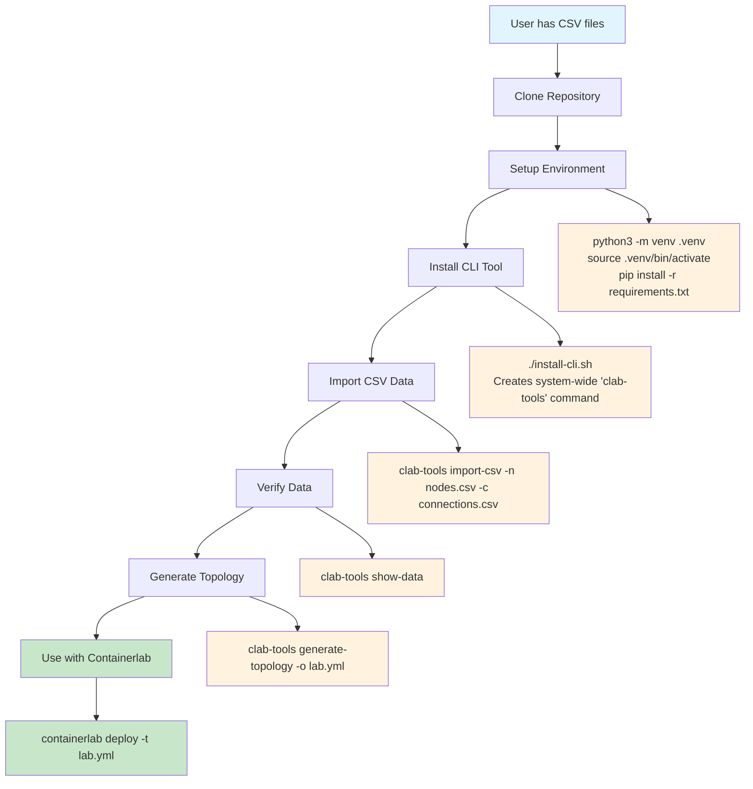
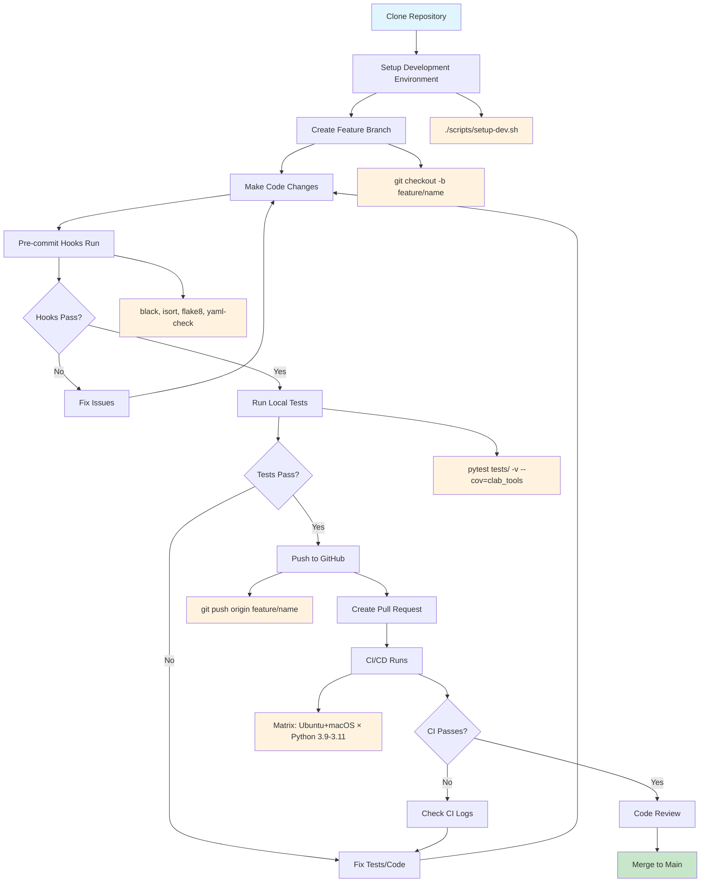
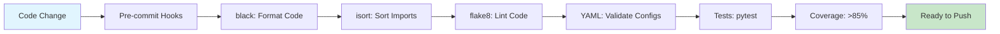
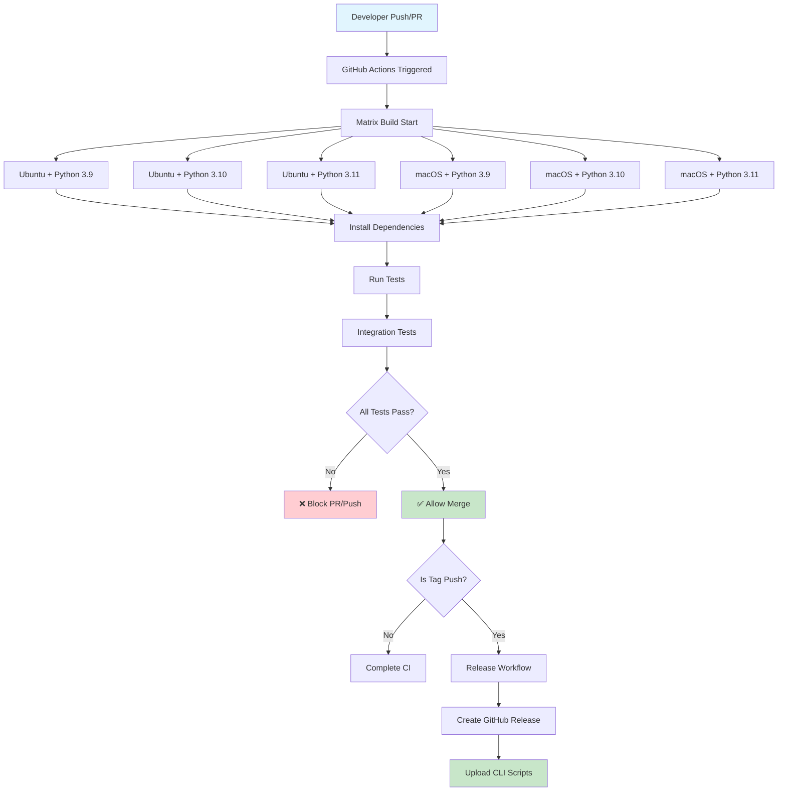
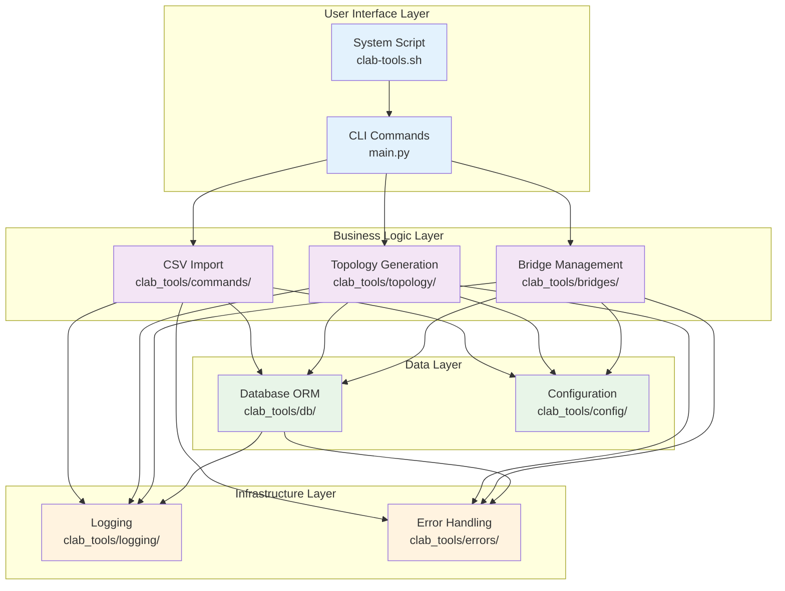

# Project Workflows and Architecture

This document provides clear visual workflows for different user types and explains the project structure to reduce confusion.

## 🎯 1. General Usage by End Users

### User Journey: From CSV to Containerlab Topology



### Simple User Commands Reference

| Step | Command | Purpose | Output Location |
|------|---------|---------|-----------------|
| 1 | `./install-cli.sh` | One-time CLI installation | System-wide `clab-tools` |
| 2 | `clab-tools import-csv -n nodes.csv -c connections.csv` | Import network data | Database in current directory |
| 3 | `clab-tools show-data` | Verify imported data | Console output |
| 4 | `clab-tools generate-topology -o lab.yml` | Create containerlab file | `lab.yml` in current directory |

### File Flow for Users

```
User Directory/
├── nodes.csv              # Input: Network nodes
├── connections.csv         # Input: Network connections
├── clab_topology.db       # Created: Database (SQLite)
└── lab.yml                # Output: Containerlab topology
```

**Key Points for Users:**
- ✅ All files created in your current working directory
- ✅ Database persists between sessions
- ✅ CLI works from any directory after installation
- ✅ No need to understand Python/development tools

---

## 🔧 2. Development and Testing by Contributors

### Developer Journey: From Code Change to Merge



### Development Environment Setup

```
Repository Structure:
clab_homelab_tools/
├── 🔧 Development Tools
│   ├── scripts/setup-dev.sh          # One-command setup
│   ├── .pre-commit-config.yaml       # Code quality automation
│   ├── requirements-dev.txt          # Dev dependencies
│   └── .github/workflows/            # CI/CD pipelines
├── 📦 Application Code
│   ├── clab_tools/                   # Main Python package
│   ├── main.py                       # CLI entry point
│   ├── requirements.txt              # Runtime dependencies
│   └── config.yaml                   # Default configuration
├── 🧪 Testing
│   ├── tests/                        # Test suite
│   ├── pytest.ini                    # Test configuration
│   └── example_*.csv                 # Test data
├── 📚 Documentation
│   ├── docs/                         # Comprehensive docs
│   ├── README.md                     # Project overview
│   └── QUICK_REFERENCE.md            # Command summary
└── 🚀 Distribution
    ├── clab-tools.sh                 # CLI wrapper script
    └── install-cli.sh                # System installation
```

### Developer Commands Reference

| Stage | Command | Purpose | When to Use |
|-------|---------|---------|-------------|
| **Setup** | `./scripts/setup-dev.sh` | Complete dev environment | Once after clone |
| **Quality** | `pre-commit run --all-files` | Run all code checks | Before committing |
| **Testing** | `pytest tests/ -v --cov=clab_tools` | Full test with coverage | Before pushing |
| **Local CLI** | `./install-cli.sh` | Test CLI installation | Testing user experience |

### Code Quality Pipeline



---

## 🚀 3. GitHub CI/CD Workflow

### Automated Pipeline: From Push to Release



### CI/CD Stages Breakdown

#### 1. **Continuous Integration (CI)**
- **Trigger**: Every push to `main`, every PR
- **Matrix**: 6 combinations (2 OS × 3 Python versions)
- **Tests**: Unit tests, integration tests, CLI tests
- **Artifacts**: Coverage reports (stored in GitHub)
- **Cost**: **FREE** (GitHub Actions free tier: 2000 minutes/month)

#### 2. **Quality Gates**
```
Required to Pass:
✅ All unit tests (pytest)
✅ Integration tests (CLI workflows)
✅ Code coverage maintains level
✅ No syntax errors
✅ All Python versions supported
```

#### 3. **Release Process**
- **Trigger**: Git tag push (e.g., `git tag v1.0.0 && git push origin v1.0.0`)
- **Actions**:
  - Run full CI pipeline
  - Create GitHub release
  - Upload CLI scripts as downloadable assets
- **Cost**: **FREE** (part of GitHub's free features)

### GitHub Features Used (All Free)

| Feature | Purpose | Cost | Notes |
|---------|---------|------|-------|
| **GitHub Actions** | CI/CD automation | FREE | 2000 minutes/month free |
| **Artifact Storage** | Coverage reports | FREE | 500MB free storage |
| **Releases** | Tagged releases | FREE | Unlimited |
| **Issue Tracking** | Bug reports, features | FREE | Unlimited |
| **Pull Requests** | Code review | FREE | Unlimited |
| **Branch Protection** | Enforce quality | FREE | Core feature |

**💰 Cost Guarantee**: This setup uses ZERO paid GitHub features!

---

## 📊 Project Structure Overview

### Logical Component Separation



### File Organization Logic

```
📁 Top Level (Minimal)
├── README.md              # 📋 Project overview only
├── QUICK_REFERENCE.md     # 🚀 Command cheat sheet
├── main.py               # 🎯 CLI entry point
├── requirements.txt      # 📦 Dependencies
├── clab-tools.sh        # 🔧 System CLI wrapper
└── install-cli.sh       # ⚙️ Installation script

📁 docs/ (Detailed Documentation)
├── installation.md       # 📖 Setup instructions
├── user-guide.md         # 👤 End user workflows
├── development-workflow.md # 🔧 Developer processes
├── configuration.md      # ⚙️ Settings and options
├── architecture.md       # 🏗️ Technical design
├── troubleshooting.md    # 🐛 Problem solving
└── api-reference.md      # 📚 Complete CLI reference

📁 Application Code
├── clab_tools/           # 🐍 Python package
├── tests/               # 🧪 Test suite
└── scripts/             # 🔧 Development utilities

📁 GitHub Integration
└── .github/             # 🚀 CI/CD and templates
```

## 🎯 Quick Navigation Guide

**I want to...**

| Goal | Go to | Quick Command |
|------|-------|---------------|
| **Use the tool** | [QUICK_REFERENCE.md](../QUICK_REFERENCE.md) | `clab-tools --help` |
| **Install it** | [docs/installation.md](installation.md) | `./install-cli.sh` |
| **Contribute code** | [docs/development-workflow.md](development-workflow.md) | `./scripts/setup-dev.sh` |
| **Understand architecture** | [docs/architecture.md](architecture.md) | Read diagrams above |
| **Fix problems** | [docs/troubleshooting.md](troubleshooting.md) | Check logs |
| **Configure it** | [docs/configuration.md](configuration.md) | Edit `config.yaml` |

**This document eliminates confusion by showing exactly who does what, when, and how!** 🎉
